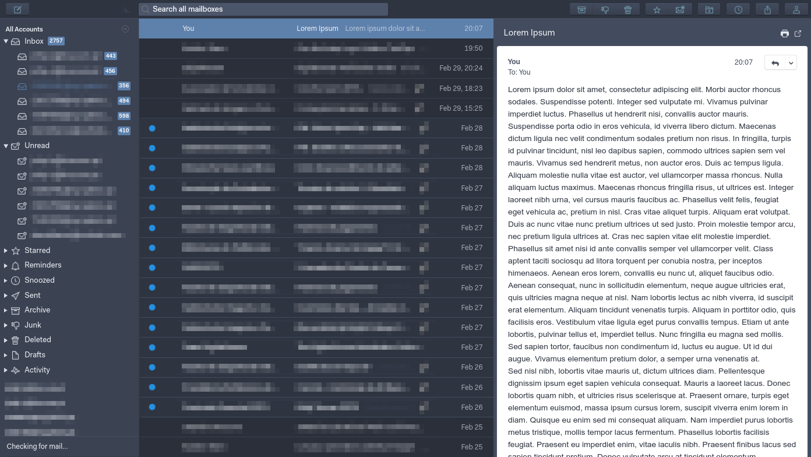

# Nord Dark Theme for Mailspring

## Color scheme based on https://www.nordtheme.com/

# How to use:
1. Clone this repo
2. Launch Mailspring
3. Go to `Edit > Install Theme...` and select the cloned folder
4. Go to `Edit > Change Theme...` and select the installed theme

# Notes:
- The message area has a white background because it's looks the best with HTML formatted emails